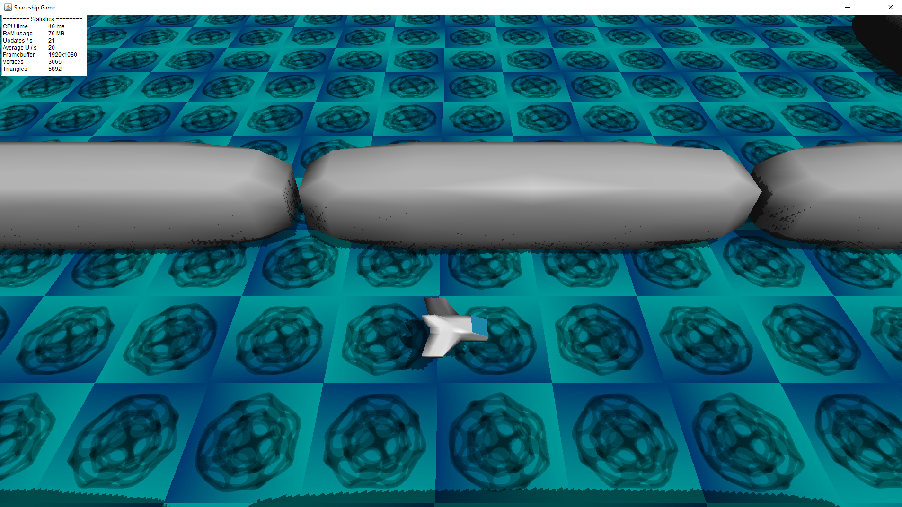
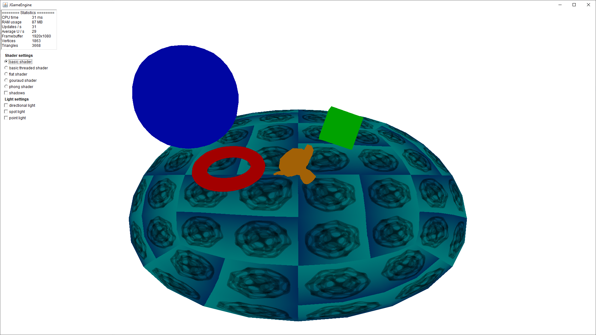
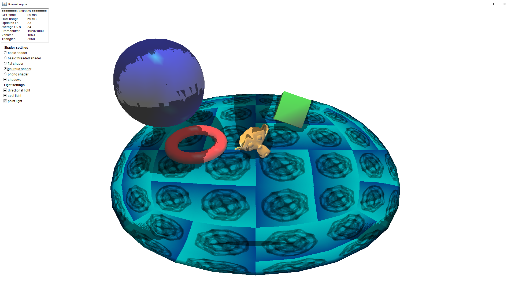
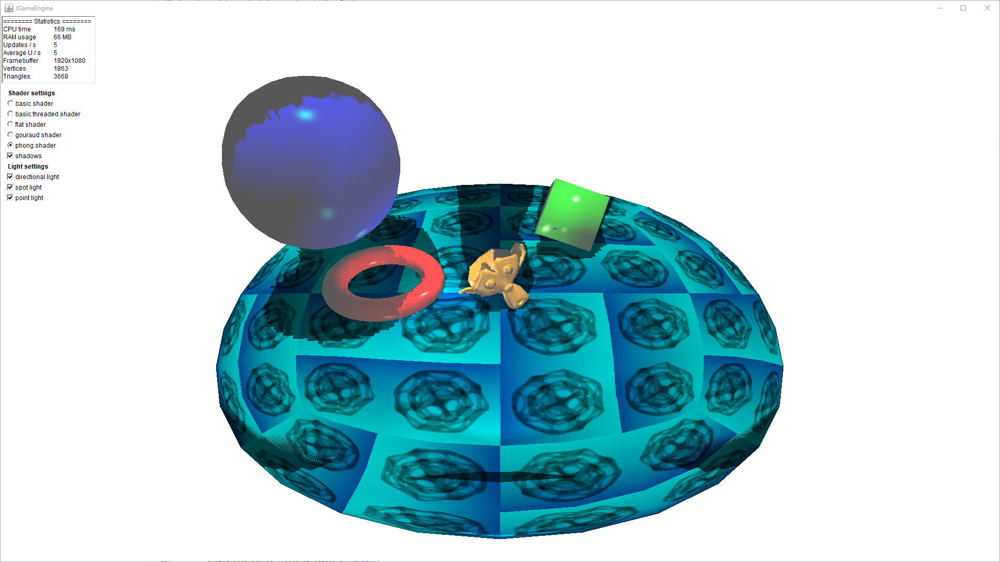

# JGameEngine

is a lightweight 3D game engine written in Java.

## TODO
* [x] No dependencies
* [x] Java 1.5+ compatibility
* [x] Fixed point math only
* [ ] Multithreading
* [x] Graphics engine
* [ ] Physics engine
* [ ] Audio engine
* [ ] Networking engine
* [x] Input engine

Graphics engine
* [x] Scanline triangle rasterization (linear interpolation, no perspective needed as big triangles are culled)
* [x] Shaders (flat, gouraud and phong shaders)
* [x] Multithreaded shaders
* [x] Point, directional and spot lights
* [x] Directional and spot light shadow mapping
* [x] Skeletal animation (experimental)
* [ ] Skybox
* [x] Custom Wavefront OBJ `.obj` importer
* [ ] Animation importer

Input engine
* [x] Keyboard
* [x] Mouse
* [ ] Gamepad
* [ ] Touch

## Tests

There are some built in tests for the game engine that can be found in the `Tests` folder.
To run the test just double click the `.jar` file.

Or open a terminal and type ``java -jar TestFile.jar``

The window size can be configured using the ``window640x480`` argument.

The render resolution can be set as a percentage of the window size using the ``render75`` argument.

## Videos

Spaceship game

Model viewer

## Screenshots

Single threaded basic shader (without lights)

Multithreaded basic shader (without lights)

Multithreaded flat shading (directional, spot and point lights and directional and spot light shadows)

Multithreaded gouraud shading (directional, spot and point lights and directional and spot light shadows)

Multithreaded phong shading (directional, spot and point lights and directional and spot light shadows)

