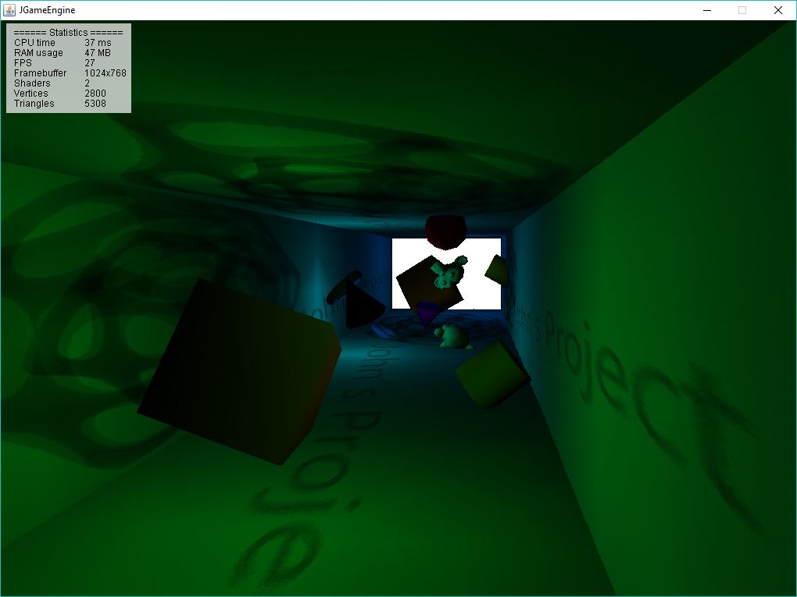

# JGameEngine

JGameEngine is a tiny 3D game engine written in Java. 
It only uses Java AWT, as the 3D part is done by software rendering.

## Features 
* Pure Java and Java 1.5+ compatibility
* Pure fixed point (no floats)
* [Blender](https://www.blender.org/) exporter and importer
* Scanline triangle rasterization (flat, gouraud and phong + texture mapping)
* Shaders (flat, gouraud and phong shaders)
* Point, directional and spot lights + shadow mapping shaders (experimental)
* Skeletal animation

## Screenshots

