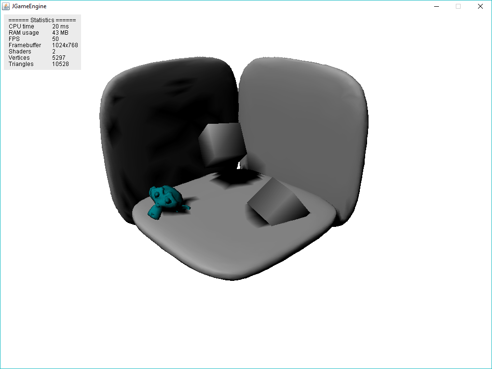
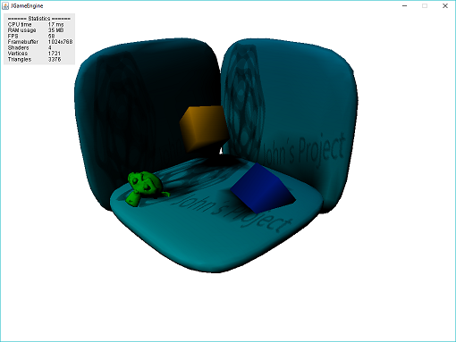
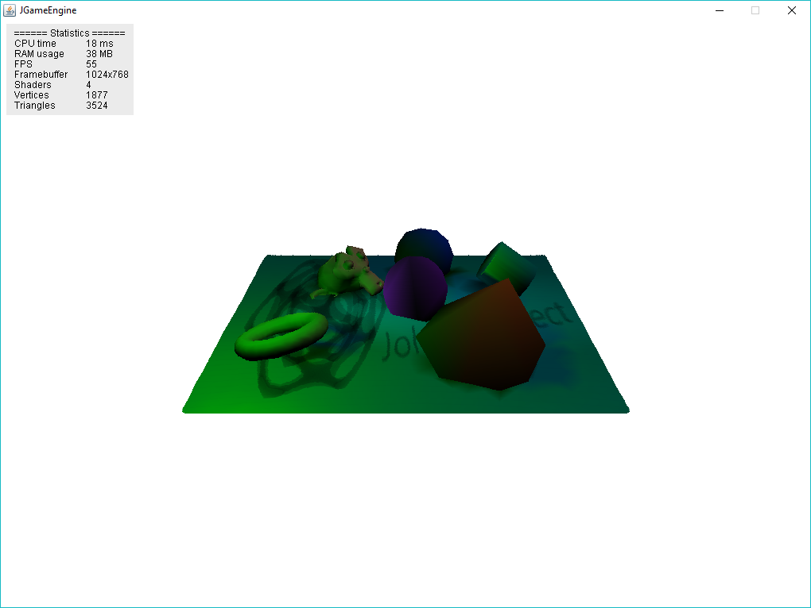

# JGameEngine

JGameEngine is a tiny 3D game engine written in Java. 
It only uses Java AWT, as the 3D part is done by software rendering.

## Features 
* Fixed point math only
* Scanline triangle rasterization 
* Flat and gouraud shaded triangles
* Perspective correct and affine texture mapping
* Point, Directional and Spot lights
* Shaders
* Gouraud and flat shaders
* Shadow mapping shaders for all three light types
* Blender exporter and importer

## Screenshots

